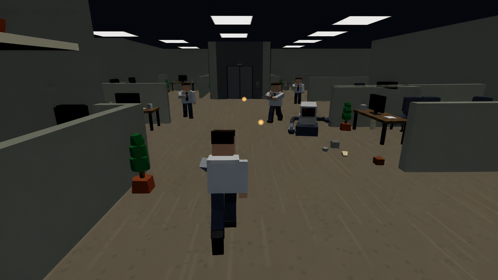

<div align="center">


<a href="https://job-roguelite.vercel.app">
  
</a>

**A low-poly 3D roguelite battle arena set in a corporate tower.**

Risk of Rain's escalation and items × Left 4 Dead's AI Director and specials —
except every biome is a department and every boss has a corner office.

### Climb the tower. Fire the C.E.O.

### [▶ Play free in your browser](https://job-roguelite.vercel.app)

[](https://github.com/MaxJafar/JOB/actions/workflows/ci.yml)
[](LICENSE)
[](https://threejs.org)
[](https://vite.dev)
[](https://rapier.rs)
[](https://job-roguelite.vercel.app)
[](https://recastnav.com)

</div>

---

## Contents

- [What this is](#what-this-is) · [Quick start](#quick-start) · [Co-op](#co-op) · [Controls](#controls)
- [The game](#the-game): [the loop](#the-loop) · [the cast](#the-cast) · [departments](#departments) · [the Director](#the-director)
- [Under the hood](#under-the-hood): [engine](#engine-layer) · [shared-truth rule](#the-shared-truth-rule) · [architecture](#architecture)
- [Hacking on it](#hacking-on-it): [data tables](#data-tables--hot-reload) · [add an enemy](#add-an-enemy) · [debug panel](#the-debug-panel)
- [Testing](#testing--ci) · [Contributing](#contributing) · [Status](#project-status) · [License](#license)

---

## What this is

J.O.B. is a browser-native 3D action roguelite: you badge in at the bottom of an
office tower, fight upward through departments that each try to kill you a
different way, and get fired — or do the firing.

It runs entirely on web tech. No engine, no editor, no asset pipeline: about
**31,000 lines of hand-written JavaScript** on top of Three.js, with every
character, prop and particle built from procedural primitives at runtime.
`npm run dev` is the whole toolchain.

**Where it stands:** this is a solo hobby project, currently at **v0.4**. It was
briefly aimed at a commercial release; it isn't any more. It's open source now
because it's more fun that way, and because the guts — an L4D-style AI Director,
a shared-truth collision model, hot-reloadable design tables — are worth reading
even if you never play it.

It is **playable and complete end to end** (seven floors, ten classes, a final
boss, meta-progression), and it is also visibly a work in progress: the art is
programmer art, several roadmap systems are stubs, and the co-op has honest
limits documented [below](#known-co-op-limits). Bug reports and pull requests
are very welcome. See [CONTRIBUTING.md](CONTRIBUTING.md).

<!--
  SCREENSHOTS: drop 2–4 captures (or a short GIF) into docs/art/ and link them
  here. Good candidates: the elevator-core holdout, a Lego-gib death, the
  Performance Review draft screen, four-player co-op converging on the core.
-->

---

## Quick start

**Requirements:** Node **≥ 20.19** and a browser with WebGL2 (any current
Chrome, Firefox, Edge or Safari).

```bash
git clone https://github.com/MaxJafar/JOB.git
cd JOB
npm install
npm run dev
```

Then open **http://localhost:5173**. That's it — no build step, no config, no
account, no assets to download.

### All the commands

| command | what it does |
|---|---|
| `npm run dev` | dev server on `:5173` with HMR, the debug panel, and the LAN relay mounted in |
| `npm run build` | production bundle → `dist/` (code-split: three / physics / nav / postfx) |
| `npm run preview` | serve the built bundle locally |
| `npm run host` | production co-op host on `:7071` — serves `dist/` **and** the relay |
| `npm test` | Vitest suite — physics, navmesh, BVH, timestep, audio, netcode, data tables |
| `npm run test:watch` | the same, in watch mode |
| `npm run lint` | ESLint |
| `npm run format` | Prettier over `src/` and `scripts/` |
| `npm run check` | **lint + test + build** — the exact gate CI runs; run it before opening a PR |
| `npm run electron` | launch the desktop shell (see [STEAM.md](STEAM.md)) |

---

## Co-op

Self-hosted, peer-to-peer-ish, and free to run. One player's game instance
simulates the world; the relay only routes messages between clients.

The relay is mounted **inside** the dev server, so a LAN party is one process,
one port, one link:

```bash
npm run dev
```

That prints your LAN address (e.g. `http://192.168.1.155:5173`). Every machine
on the network opens **that same link** → **CO-OP SHIFT**. Open shifts appear in
the browser on their own — the client derives `ws://<same-host>/ws` from
`location` and polls `/api/rooms` — so nobody types an IP. Click a row to join,
or **START A NEW SHIFT** to open one.

For a built copy, `npm run build && npm run host` serves the game and the relay
together on `:7071` (override with `PORT=9000`). Playing across the internet
works through the **advanced** field: port-forward, Tailscale, or point it at
any reachable relay URL.

In co-op the team badges in on **four different sides** of the floor plate and
has to cut inward through the department to meet at the elevator core.

### Known co-op limits

An honest list, because these will bite you before the code explains itself:

- Guests see host-simulated enemies at **12 Hz with interpolation**. Hit feedback
  is optimistic; damage is host-resolved. Fine for co-op, not for competitive.
- **Destructible props and debris are not state-synced** — cosmetic desync only,
  but two players will remember a different-looking room.
- **Host migration** mid-run promotes a guest, but enemies re-sync from scratch.
- **No rollback or prediction** on guest projectiles — guest tracers are cosmetic.

The transport is behind an interface (`src/net/transport.js`), so swapping
WebSockets for WebRTC or Steam Datagram Relay is a constructor argument, not a
rewrite. There's a `LoopbackTransport` that makes the whole co-op message flow
unit-testable in-process.

---

## Controls

| | |
|---|---|
| `WASD` / `Shift` / `Space` | move / sprint / jump |
| `Ctrl` or `C` while sprinting | slide — **slide → jump keeps your momentum** |
| `Q` | coffee dash (i-frames; the universal escape) |
| `LMB` / `RMB` | primary / class signature — the chassis, which loot can never replace |
| `X` | **SPECIAL module** — whatever punch card is in the slot |
| `R` | reload (ranged classes run mags; IT and the Barista run heat gauges) |
| `G` / `F` | throw grenade / use consumable |
| `Tab` | inventory — install punch cards, equip looted clothing and gear |
| `V` | toggle first ↔ third person |
| `E` | interact (crates, elevator, office utilities) |
| `Esc` / `P` | pause |
| `` ` `` | **debug panel** — see [below](#the-debug-panel) |

---

## The game

### The loop

**0. Badge in at a fire stairwell** and fight to the middle of the floor. Every
floor is a hub: a central **ELEVATOR CORE** — the only way up — with four wings
radiating out to the stairs on each side of the plate. Enemies die like dropped
Lego sets: every body part detaches and tumbles as a real rigid body. Desks,
cabinets and machines break for real, colliders and all.

**1. Kill feral coworkers** for `$` and XP. Specials and bosses drop
**briefcases**: wearable clothing across four slots — HEAD / BODY / LEGS /
TRINKET — that renders on your character *and* on your teammates', with rarity
(SENIOR / EXECUTIVE) visible as a glow. Plus throwables (`G` — stapler grenades,
tape balls, coffee molotovs) and consumables (`F`).

**2. Building your character is the game.** Your class is a *chassis*: the LMB
weapon and RMB signature are fixed forever. Everything else is loot. Two slots
hold **punch-card modules** — a SPECIAL on `X` and a PASSIVE that quietly
rewrites a rule.

> Special cards are *the other classes' abilities* — find a Body Check card as
> the Intern and you get to shoulder-charge a crowd. Passives change how the
> game works rather than what your numbers are: furniture you break detonates;
> every kill stuns the neighbours; a killing blow leaves you at 1 HP once per
> floor.

Three rarity tiers scale the numbers *and* cut the cooldown. A pity timer stops
a run of greys. Your combo at the moment of the kill sweetens the roll. Every
department head drops **the same card every time** — a jackpot you can plan a
run around. Pick a card up and the difficulty clock stops for 20 seconds, so you
actually get to feel it. Specials, elites, KPIs and bosses drop them; trash mobs
never do.

**3. Every level-up triggers a PERFORMANCE REVIEW** — draft 1 of 3 perks,
including **class evolutions**: ricochet staples, dust-storm broom waves, tax
bombs, forking pink slips, overclocked beams, boomerang cards.

**4. Chain kills to build COMBO.** Speed and attack rate climb with the meter
(×5 SYNERGY! … ×35 HOSTILE TAKEOVER!!!).

**5. Buy supply crates** → 19 stacking items, including deliberate trade-offs
(📛 +25% damage / −7% speed · 🪙 double money, but getting hit dumps your wallet).

**6. Work the office utilities:** 3D-print a duplicate item, chug a fresh pot,
shred a common for cash, hydrate for a free heal.

**7. Chase optional QUARTERLY KPIs** — kill sprints, spotless streaks, appliance
demolition — for bonus budget and items.

**8. Regroup at the core and call the elevator.** This is the whole back half of
a floor. Shutters slam down on all four core mouths, the department pours in in
scripted waves, and at 45% the biome's **FLOOR LEAD** overrides the call: the
progress bar hard-stops at 90% until you kill them. Then the **Department Head**
rides down to meet you. Fire them. Board. Ascend.

**9. LOBBY → HUMAN RESOURCES → I.T. → FINANCE → MARKETING → SALES →
THE PENTHOUSE**, where the C.E.O. waits — two phases, throne mech, layoff
shockwaves, quarterly laser.

**10. Difficulty scales with *time*, not floors:** PROBATION → CRUNCH TIME →
HOSTILE WORKPLACE → MARKET COLLAPSE. Watch for floor-wide chaos events —
**LIGHTS OUT** and **FIRE DRILL** (frenzy, but 2× money). Post-win endless mode
loops the tower harder.

**11. Death pays Severance** → permanent perks in the MOTIVATION department.
Rogue-*lite*.

### The cast

Ten chassis. The LMB weapon and RMB signature never change — that's the point.

| class | kit |
|---|---|
| 📎 **THE INTERN** | stapler sidearm · staple fan burst · +XP |
| 🧹 **THE JANITOR** | broom sweeps · trash-lid block (hold RMB) · tanky |
| 🧮 **THE ACCOUNTANT** | calculator SMG · AoE "Tax Audit" vulnerability mark · +money |
| 📁 **THE HR REP** | homing pink slips · slow-field "Mandatory Meeting" · −10% damage taken |
| 💻 **IT SUPPORT** | chaining ethernet beam · router turrets · regen |
| 📇 **THE SALES REP** | piercing business cards · "Cold Call" knockback cone · fastest |
| 🧯 **THE MARKETING MANAGER** | **rides an office chair** · CO₂ extinguisher cone · "Full Send" rocket-boost ram · cannot slide, drifts through turns |
| 🥊 **THE FACILITIES GUY** | **no weapon — hands** · jab/jab/HAYMAKER combo · "Body Check" shoulder charge · 235 HP, 65% knockback resist |
| ☕ **THE BARISTA** | unbolted steam wand · **hard falloff cliff at 8m** · "Steam Burst" spends the entire heat gauge at once — run hot for a bigger burst, and the lockout is the price |
| 📐 **THE ANALYST** | **hold-to-charge** Ledger Rifle — 0.55× panicked, 3.2× fully charged and it pierces the whole line · crits pay ×3 · "Risk Assessment" flags a target for +45% · genuinely helpless in a swarm |

### Departments

Every floor is a biome with its own staff, its own floor lead, and its own way
of killing you. **The mob is the mechanic.**

| floor | the threat | staff |
|---|---|---|
| **THE LOBBY** | tutorial pressure | Paperlings · Cubicle Drones · Rogue Printers · Roomba-C4 |
| **HUMAN RESOURCES** | *you cannot leave* — slow, wide bodies whose hits **root** you, and each one nearby taxes your movement. Six of them is a cage. | Talent Partners · Intake Coordinators · **The Mediator** (lassos you into a mandatory 1:1 — dash to cut it) |
| **I.T.** | everything is **live** — arcs and EMP fields take your dash, grenade and ability bar offline | Field Technicians (chaining tesla arcs) · Server Racks (walking damage aura) · **The Sysadmin** (drops EMP zones) |
| **FINANCE** | attrition and elites | Copier Golems · Delivery Drones · **The Complainer** |
| **MARKETING** | paper-thin and **endless** — 13 HP each, arriving forty at a time, screaming to pull the whole floor onto you | Brand Interns (scream + throw phones) · Growth Hackers · **The Live-Streamer** (goes live, marks you, summons an audience) |
| **SALES** | commitment — telegraphed charges you have to read | Junior Closers (handshake charge) · **The Micromanager** |
| **THE PENTHOUSE** | every department at once | all of the above |

**Status effects** (chips appear above the crosshair):

- 📋 **IN A MEETING** — rooted, HR. Diminishing returns mean each successive stun
  lands shorter, and **dash always works**. It is the one escape, and it costs
  your 3.6s cooldown.
- ⚡ **SYSTEMS OFFLINE** — IT shock: no dash, no ability, no grenade.
- 🪢 **DASH TO BREAK** — the Mediator is reeling you in.
- 🚧 **BOXED IN** — the crowd tax, up to −60% move speed.

### The Director

[`src/game/director.js`](src/game/director.js) is a Left 4 Dead-style pacing
engine, and it's the most interesting file in the repo.

- **Intensity tracking** per player (damage taken, kills nearby) drives
  RELAX → BUILD-UP → PEAK → FADE cycles. Quiet lulls, then murder.
- Spawns are placed **out of sight** — behind occluders, outside your view cone.
- **Specials on token cooldowns:** *The Gossip* (pops into rumor gas → the horde
  targets you) · *The Complainer* (scalding coffee pools) · *The Micromanager*
  (pounces and rides you — mash `Space` or dash) · *The Motivator* (rallies
  nearby mobs +30% speed — kill it first).
- **Department specials** join the roster per biome: *The Mediator* (HR),
  *The Sysadmin* (IT), *The Live-Streamer* (Marketing).
- **Rares:** **KAREN** (the witch — don't provoke her; she one-taps back) and
  **THE AUDITOR** (the tank — drops a guaranteed item).
- **Crescendos:** the sealed core holdout + floor lead · fire-alarm boxes (shoot
  one = instant horde) · exploding espresso machines · popping vending machines.
- Underneath all of it, a Risk-of-Rain difficulty coefficient scales enemy HP,
  damage, money, spawn caps and **elite** rolls (OVERTIME / SYNERGIZED).

---

## Under the hood

### Engine layer

The simulation sits on a small engine layer in `src/core/`. Full contract:
**[docs/ENGINE.md](docs/ENGINE.md)**.

| | |
|---|---|
| **Rapier** | world colliders + rigid-body Lego gibs that land on real desks; opt-in character motor |
| **three-mesh-bvh** | exact hitscan and AI line of sight — replaced a 0.7u ray march that tunnelled through thin walls |
| **recast-navigation** | per-floor navmesh; enemies route around cubicles instead of pressing into them |
| **postprocessing** | bloom → vignette → tone mapping in one pass; the vignette doubles as the low-HP readout |
| **fixed timestep** | 60 Hz sim, so dash distance and jump apex don't depend on your monitor |
| **voice manager** | a 40-mob horde can't fire 40 simultaneous voices over your hit confirms |

Every one of these is **optional at runtime**. If a WASM module fails to load,
the game falls back to its original code path rather than failing to boot. A
missing module costs a capability, never the boot.

### The shared-truth rule

The load-bearing architectural decision, and the one worth stealing:

```
Level.colliders ──┬── collideCircle()   movement
                  ├── WorldBVH          hitscan + line of sight
                  ├── NavMesh           enemy pathing
                  └── PhysicsWorld      debris + character motor
```

`WorldBVH`, `NavMesh` and `PhysicsWorld` are all built from the **same** AABB
list that movement uses. If bullets used render meshes while bodies used AABBs,
you get *"I shot through the desk I can't walk through"* bugs that are miserable
to chase. Same source, three indexes over it.

The single funnel for changing a collider is `Level.setColliderDisabled()`,
which marks the BVH dirty and toggles the Rapier collider. Never assign
`collider.disabled` directly — elevator doors, paid doors, arena seals and
smashed furniture all go through the funnel.

**Measured cost** (LOBBY floor, 91 colliders, 9 rooms — paid once behind the
elevator fade, never per frame): WorldBVH build ~4.6 ms · NavMesh build ~48 ms ·
Rapier sync ~1 ms. At runtime: BVH raycast ~9 µs · navmesh path ~0.6 ms ·
physics step with 15 gibs ~0.3 ms. A 3-minute headless soak with 58 live enemies
ran at **0.22 ms/tick** against a 16.6 ms budget.

### Architecture

```
data/        design tables as JSON — enemies, classes, bosses, floors, gear,
             modules, waves, difficulty, and every tuning constant
src/
  core/      input (pointer-lock) · synth audio + generative elevator muzak ·
             physics · navmesh · worldbvh · timestep · postfx · voices ·
             telemetry · crash handler · pooling · math
  game/      game.js (orchestrator) · player (FP/TP rig) · classes (chassis) ·
             modules (punch-card loot: PASSIVE + SPECIAL slots) · enemies ·
             bosses · director · level + floorplan (seeded floor gen) · items ·
             gear · kpis · projectiles · effects · props · characters ·
             meta (localStorage perks)
    bot/     AI teammates that drive the real class kits — brain, squad, tactics
  anim/      skeleton, IK, foot-lock, blendspaces, retargeting, secondary motion
  render/    VFX, decals, instancing, quality governor
  net/       net.js (host-authoritative co-op) · transport.js (pluggable pipe)
  ai/        LOD + pressure heuristics
  ui/        hud.js · menus.js
  dev/       debug panel · GPU stats
server.js    self-hosted WebSocket relay (rooms, host promotion)
electron/    desktop shell
tests/       Vitest — engine layer, netcode, data-table integrity
```

Three conventions hold the whole thing together:

1. **All world mutations flow through `Game` methods** — `damageEnemy()`,
   `explode()`, `grantReward()` and friends — so netcode hooks in exactly one
   place. If you mutate an enemy directly, you've just broken co-op.
2. **Content is data, not code.** Enemies, floors, items and class stats are
   table entries. Adding content means adding a row, not a system.
3. **Everything is procedural primitives.** No asset pipeline. Materials are
   cached; projectiles, particles and damage numbers are pooled.

---

## Hacking on it

This is the fun part, and the main reason the repo is public.

### Data tables & hot reload

Every number that defines how the game feels lives in `/data/*.json`:

| file | holds |
|---|---|
| `tune.json` | 32 movement/combat constants — gravity, dash speed, coyote time, jump buffer, friction… |
| `enemies.json` | 23 enemy definitions + elite modifiers |
| `classes.json` | per-chassis HP, speed, damage, cooldowns, magazine sizes |
| `bosses.json` | department heads and the C.E.O. |
| `floors.json` | the floor list, biome composition, and the sandbox floor |
| `gear.json` | throwables, consumables, wearables, rarity tiers |
| `modules.json` | punch-card tiers, roll weights, passives, guaranteed boss cards |
| `waves.json` · `difficulty.json` | lockdown/horde scripts, difficulty stages |

**Edit one while the game is running and it hot-applies without losing your
run.** Change `dashSpeed`, save, and your very next dash is different.

That works because reloading **mutates the existing objects in place** rather
than replacing them — every consumer (`TUNE`, `ENEMY_DEFS`, a live enemy's own
`def` reference) holds a live pointer, so object identity has to survive the
swap. See [`src/game/dataUtils.js`](src/game/dataUtils.js) for the 40 lines that
make it work, including the `"0x..."` → number pass that exists because JSON has
no hex literals.

### Add an enemy

1. Add an entry to `data/enemies.json` under `defs` — stats, AI type, economy:

   ```json
   "shredder": {
     "name": "Document Shredder",
     "hp": 60, "dmg": 14, "speed": 3.2, "radius": 0.5, "centerY": 1.0,
     "xp": 5, "money": 8, "credit": 10,
     "ai": "melee", "attackRange": 1.8, "attackCd": 1.2, "windup": 0.4
   }
   ```

2. Give it a silhouette: add a `case 'shredder':` to `buildMesh()` in
   [`src/game/enemies.js`](src/game/enemies.js), composed from the `box`/`cyl`
   primitives in `props.js`. (Reusing an existing body type is pure JSON — only
   a genuinely new shape needs this step.)
3. Put it on a floor by adding the key to that biome's roster in
   `data/floors.json`.
4. Press `` ` `` in-game and spawn it directly from the debug panel.

Adding a **module**, **item**, **KPI** or **perk** follows the same shape: a
table entry, plus a closure only if the behaviour is genuinely new.

### The debug panel

Press `` ` ``. This is the single best way to understand the codebase.

Live perf graph · Director state and overrides · spawn any enemy or boss ·
grant any loot · warp to any floor · god mode · time scale · post-FX quality ·
sim rate · live `TUNE` sliders with **copy-as-JSON** (tune by feel, paste the
result straight into `data/tune.json`) · telemetry export.

Always on in `npm run dev`. In a release build it stays dormant until you set
`localStorage['job.debug'] = '1'`, and it's a dynamic import, so it never enters
the main bundle.

### Engine settings that change behaviour

Persisted in `meta.settings`:

| key | default | effect |
|---|---|---|
| `postfx` | `'high'` | `off` \| `low` \| `high` |
| `fixedStep` | `true` | 60 Hz fixed sim vs. raw frame delta |
| `physicsDebris` | `true` | Rapier gibs vs. the legacy bouncer |
| `physicsMotor` | `false` | Rapier character motor vs. the hand-tuned one |
| `telemetry` | `true` | local-only run log |

---

## Testing & CI

```bash
npm test        # the suite
npm run check   # lint + test + build — exactly what CI runs
```

Twelve test files cover the parts where a silent regression is expensive: BVH
raycasts, navmesh pathing, Rapier physics and the character motor, the
fixed-timestep accumulator, audio voice limits, floor-plan generation, module
rolls, department specials, data-table integrity, and the co-op transport (host
migration, addressing, room isolation — via the in-process `LoopbackTransport`).

GitHub Actions runs lint + test + build on every push and PR, and uploads the
web build as an artifact.

---

## Contributing

Yes please. This is a hobby project with no roadmap obligations to anyone, which
means there's room to just try things.

Read **[CONTRIBUTING.md](CONTRIBUTING.md)** for setup, code style, and the
data-table-first content workflow. The short version:

- Run `npm run check` before opening a PR.
- Content (enemies, modules, floors, items) should be a table entry wherever
  possible.
- World mutations go through `Game` methods so co-op doesn't break.
- Match the surrounding code — this codebase comments *why*, not *what*.

Good first issues: new enemy types, new punch-card modules, new KPIs, balance
passes using the debug panel's copy-as-JSON, and bug reports of any kind.

---

## Project status

Currently **v0.4 "NEW HIRES"**. Shipped so far: the engine hardening layer, the
floor-plate and labyrinth level generators, unique department specials, the
archetype-and-slot rework, bot teammates, and the VFX/animation runtime.

The full plan lives in **[docs/ROADMAP.md](docs/ROADMAP.md)** — remaining
milestones are DRESS CODE (visible equipment) → SECURITY ALERT (Director 2.0) →
GLOW UP (art and juice) → FIRST DAY (onboarding, HUD 2.0).

> **Note:** the roadmap was written while this was a commercial project, so §1
> and parts of §2 describe a two-SKU release plan, pricing, ads and wishlist
> targets. **That plan is dead.** Ignore the money; the feature milestones are
> still the plan. [STEAM.md](STEAM.md) likewise now just documents *how* you'd
> wrap the game in Electron if you wanted a desktop build — not an intention to
> sell one.

Design work is grounded in [docs/DESIGN_DIGEST.md](docs/DESIGN_DIGEST.md), 195
principles mined from Schell's *The Art of Game Design* and Killick's *Game
Design: How Games Are Made*. Art direction: [docs/art/](docs/art/).

---

## License

**[MIT](LICENSE)** — do whatever you like with it. Fork it, learn from it, strip
it for parts, ship your own office roguelite. Attribution is appreciated but not
required.

## Credits

Built by [MaxJafar](https://github.com/MaxJafar).

Standing on: [three.js](https://threejs.org) ·
[Rapier](https://rapier.rs) ·
[recast-navigation-js](https://github.com/isaac-mason/recast-navigation-js) ·
[three-mesh-bvh](https://github.com/gkjohnson/three-mesh-bvh) ·
[postprocessing](https://github.com/pmndrs/postprocessing) ·
[Vite](https://vite.dev) · [Vitest](https://vitest.dev).

Owes its ideas to **Risk of Rain 2** and **Left 4 Dead**. Not affiliated with,
endorsed by, or a threat to either.
